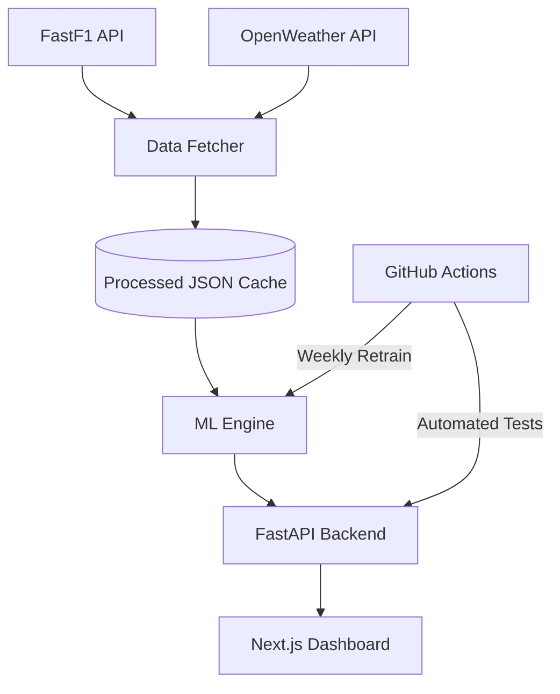

# Pit Stop — The Future of F1 Strategy 🏎️


[](https://github.com/PranathiBs/Pit-stop-F1-Prediction-and-Gran-Prix-calendar--master/actions/workflows/pipeline.yml)
[](https://github.com/PranathiBs/Pit-stop-F1-Prediction-and-Gran-Prix-calendar--master)
[](https://opensource.org/licenses/MIT)

**Pit Stop** is a professional, self-sustaining Formula 1 Prediction Engine & Strategy Dashboard. It bridges the gap between raw telemetry and actionable race insights using state-of-the-art MLOps practices and a high-performance Next.js frontend.

---

## ✨ Features

- 🏎️ **AI Strategy Engine**: Predicts podium finishers and optimal pit stop windows based on grid position and historical performance.
- 🌦️ **Real-time Weather Integration**: Factors in live track conditions using the OpenWeather API for dynamic race-day predictions.
- 🔄 **'Forever' Data Pipeline**: Automated weekly retraining via GitHub Actions to keep the Random Forest model updated with the latest season's data.
- 📦 **JSON Caching Layer**: Ultra-fast response times and high availability by reducing dependency on external F1 APIs.
- 📊 **Telemetry Visualization**: Stunning interactive charts powered by Recharts for race calendar and performance analytics.
- 🛡️ **System Guardrails**: Integrated smoke tests and automated health checks to ensure 24/7 reliability.

## 🛠️ Tech Stack

### Frontend
- **Framework**: Next.js 16 (App Router)
- **Styling**: Tailwind CSS 4 & CSS Modules
- **Animations**: Framer Motion
- **Visuals**: Recharts & Lucide React
- **Auth/Store**: Supabase

### Backend & ML
- **Language**: Python 3.11+
- **API Framework**: FastAPI
- **Machine Learning**: Scikit-Learn (Random Forest)
- **Data Source**: FastF1 & OpenWeather API
- **Automation**: GitHub Actions

---

## 🏗️ Architecture



### Project Structure
```text
├── .github/workflows/
│   └── pipeline.yml         # CI/CD: Tests, Trains, and Commits updates
├── data/
│   └── processed/           # JSON Caching Layer (The 'Forever' storage)
├── docs/
│   └── images/              # Project assets & banner
├── models/                  # Versioned ML Model Binaries (.joblib)
├── src/
│   ├── main.py              # Production FastAPI Backend
│   ├── data_fetcher.py      # FastF1 & OpenWeather integration logic
│   └── model_engine.py      # Podium Prediction ML logic
├── scripts/
│   └── update_engine.py     # Automation script for weekly retraining
├── tests/
│   └── check_system.py      # System validation & Smoke testing
├── package.json             # Frontend dependencies & scripts
└── requirements.txt         # Backend dependencies
```

---

## 🚀 Getting Started

### Prerequisites
- Python 3.11+
- Node.js 20+
- OpenWeather API Key

### Installation

1.  **Clone the repository**:
    ```bash
    git clone https://github.com/PranathiBs/Pit-stop-F1-Prediction-and-Gran-Prix-calendar--master.git
    cd Pit-stop-F1-Prediction--master
    ```

2.  **Environment Setup**:
    Create a `.env` file in the root directory:
    ```env
    NEXT_PUBLIC_OPENWEATHER_API_KEY=your_key_here
    NEXT_PUBLIC_SUPABASE_URL=your_supabase_url
    NEXT_PUBLIC_SUPABASE_ANON_KEY=your_supabase_key
    ```

3.  **Install Dependencies**:
    ```bash
    # Python dependencies
    python -m venv .venv
    .\.venv\Scripts\activate
    pip install -r requirements.txt

    # Node dependencies
    npm install
    ```

4.  **Run Development Server**:
    ```bash
    npm run dev
    ```
    *This command runs both the Next.js frontend and the FastAPI backend concurrently.*

---

## 📡 API Endpoints

| Endpoint | Method | Description |
| :--- | :--- | :--- |
| `/health` | `GET` | Returns system status and model readiness. |
| `/api/calendar/{year}` | `GET` | Fetches the full season schedule. |
| `/predict/race/{year}/{gp}` | `GET` | AI-generated podium predictions based on grid and weather. |

---

## 🤝 Contributing

Contributions are what make the open source community such an amazing place to learn, inspire, and create. Any contributions you make are **greatly appreciated**.

1. Fork the Project
2. Create your Feature Branch (`git checkout -b feature/AmazingFeature`)
3. Commit your Changes (`git commit -m 'Add some AmazingFeature'`)
4. Push to the Branch (`git push origin feature/AmazingFeature`)
5. Open a Pull Request

---

## 📜 License

Distributed under the MIT License. See `LICENSE` for more information.

---

<p align="center">
  *Built with ❤️ for F1 fans and MLOps enthusiasts.*
</p>
